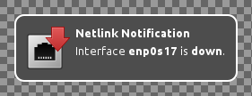
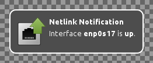

netlink-notify
==============

**Notify about netlink changes**

This runs in background and produces notifications whenever a netlink event
is received. Notifications look like this:

A device is down:

A device is up:

A device received an IP address:

A device received an IPv6 address:

A device disappeared:

Requirements
------------

To compile and run `netlink-notify` you need:

* [libnotify](http://library.gnome.org/devel/notification-spec/)
* [linux](http://www.kernel.org/)
* [markdown](http://daringfireball.net/projects/markdown/) (HTML documentation)

Some systems may require additional development packages for the libraries.
Look for `libnotify-devel` or similar.

Build and install
-----------------

Building and installing is very easy. Just run:

> make

followed by:

> make install

This will place an executable at `/usr/bin/netlink-notify`,
documentation can be found in `/usr/share/doc/netlink-notify/`.
Additionally a desktop file is installed to `/etc/xdg/autostart/`, this
automatically starts the program when logged in to a desktop environment.

Usage
-----

Just run `netlink-notify` after installation or re-login to desktop
environment for autostart.
