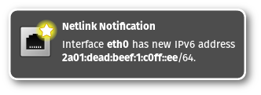

netlink-notify
==============

**Notify about netlink changes**

This runs in background and produces notifications whenever a netlink event
is received. Notifications look like this:

A device is down:

A device is up:

A device received an IP address:

A device received an IPv6 address:

A device disappeared:

Requirements
------------

To compile and run `netlink-notify` you need:

* [systemd](https://www.github.com/systemd/systemd)
* [libnotify](https://developer.gnome.org/notification-spec/)
* [linux](https://www.kernel.org/)
* [markdown](https://daringfireball.net/projects/markdown/) (HTML documentation)
* [inkscape](https://inkscape.org/) (convert icons from SVG to PNG)

Some systems may require additional development packages for the libraries.
Look for `libnotify-devel` or similar.

Build and install
-----------------

Building and installing is very easy. Just run:

> make

followed by:

> make install

This will place an executable at `/usr/bin/netlink-notify`,
documentation can be found in `/usr/share/doc/netlink-notify/`.
Additionally a systemd unit file is installed to `/usr/lib/systemd/user/`.

Usage
-----

Just run `netlink-notify` to run it once. A systemd user service can be
started and/or enabled with `systemctl --user start netlink-notify`
or `systemctl --user enable netlink-notify`.

License and warranty
--------------------

This program is free software: you can redistribute it and/or modify
it under the terms of the GNU General Public License as published by
the Free Software Foundation, either version 3 of the License, or
(at your option) any later version.

This program is distributed in the hope that it will be useful,
but WITHOUT ANY WARRANTY; without even the implied warranty of
MERCHANTABILITY or FITNESS FOR A PARTICULAR PURPOSE.  See the
[GNU General Public License](COPYING.md) for more details.

### Upstream

URL:
[GitHub.com](https://github.com/eworm-de/netlink-notify#netlink-notify)

Mirror:
[eworm.de](https://git.eworm.de/cgit.cgi/netlink-notify/)
[GitLab.com](https://gitlab.com/eworm-de/netlink-notify#netlink-notify)
